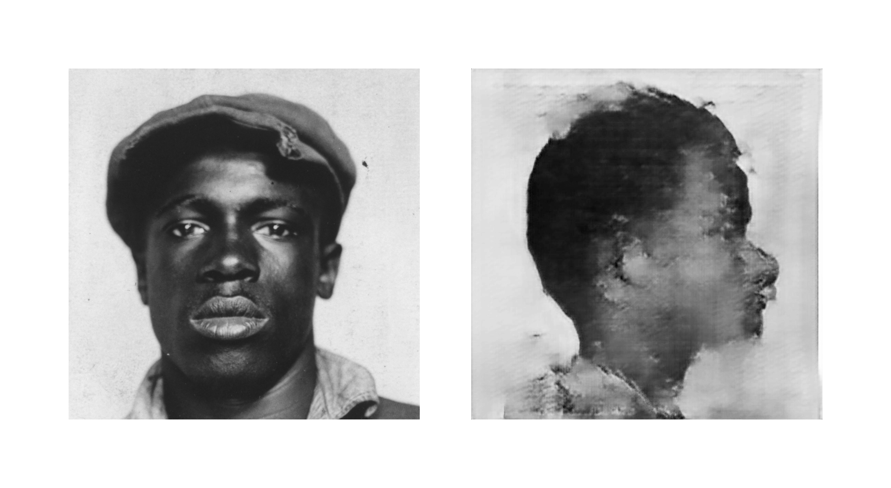

# mugshots

The main idea behind the "mugshots" project is to be able to generate a side view from a given image showing the front view of a face. I know what you are probably thinking, "what are you thinking, that's not possible."  Nonetheless, after reading the Image-to-Image paper and U-Net paper and some others covering the topic of a generative adversarial network (GAN), I thought it would be a fun project to try it out -- anyway. The GAN model I implemented is based on these papers with some alterations.
